# Flutter Clock

# Features
* The weather changes the overall theme.
* There is a dark mode for each theme.
* The speed of the waves depend on the temperature.
* As the time progresses, the digits can be seen transitioning to the bottom of the screen to allow for accessibility, as one can understand the time just by looking at the positions of the digits rather than the numbers themselves.

# Themes
## Rainy
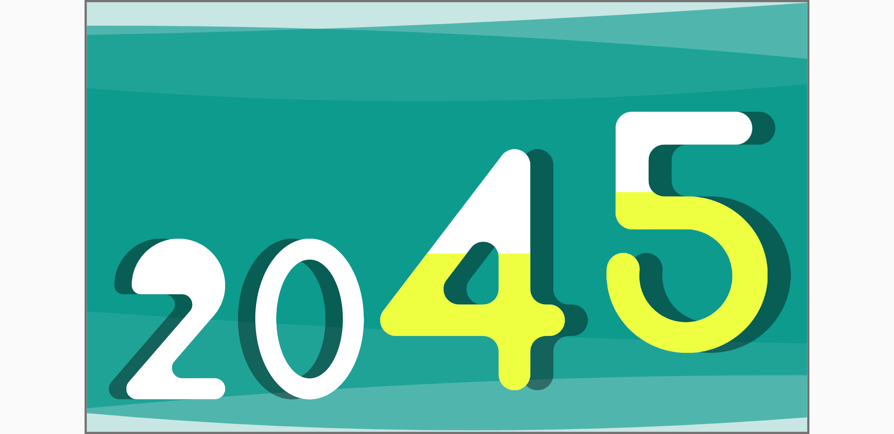 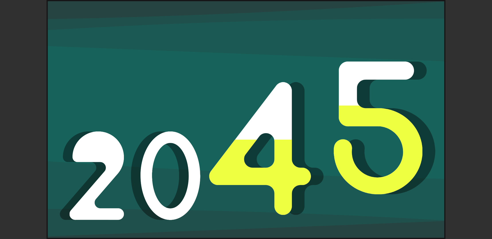
## Foggy
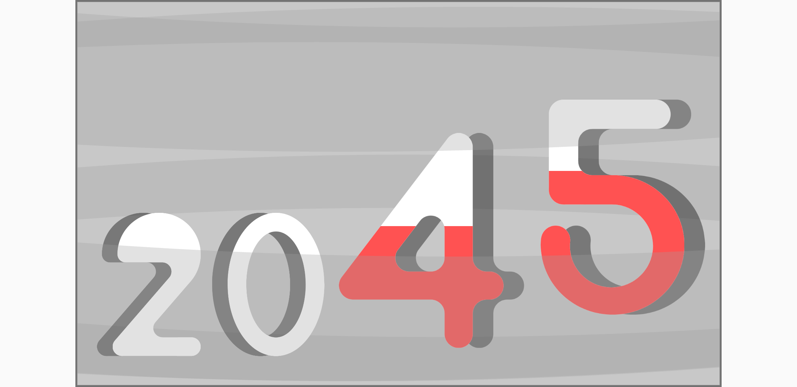 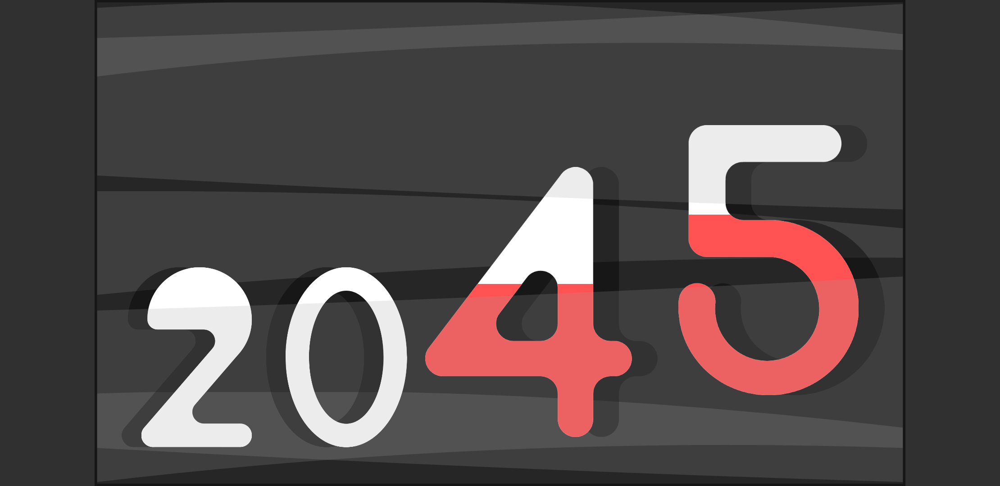
## Cloudy
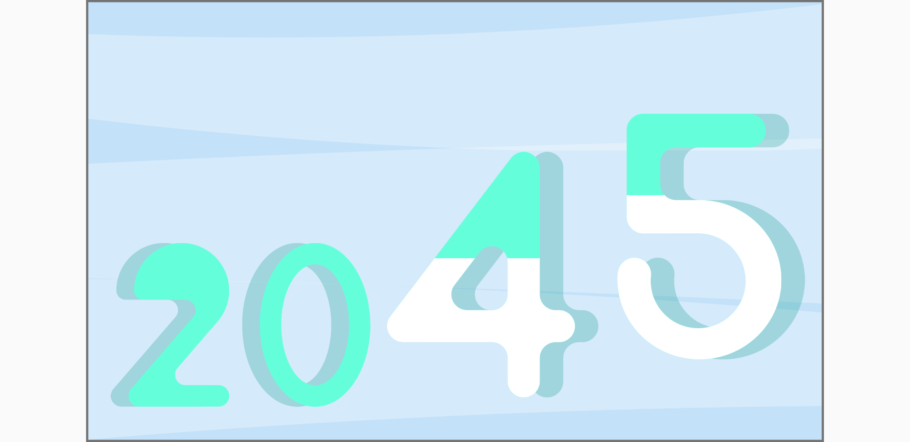 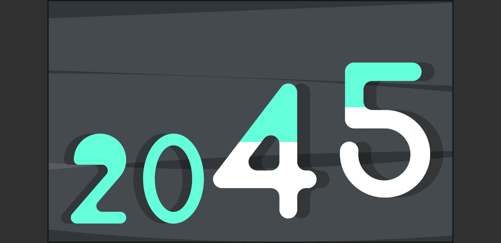
## Snowy
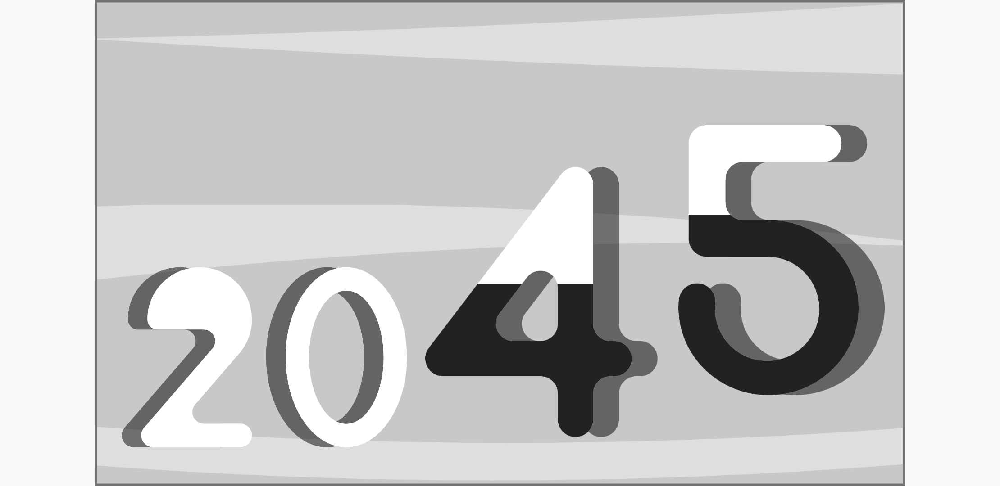 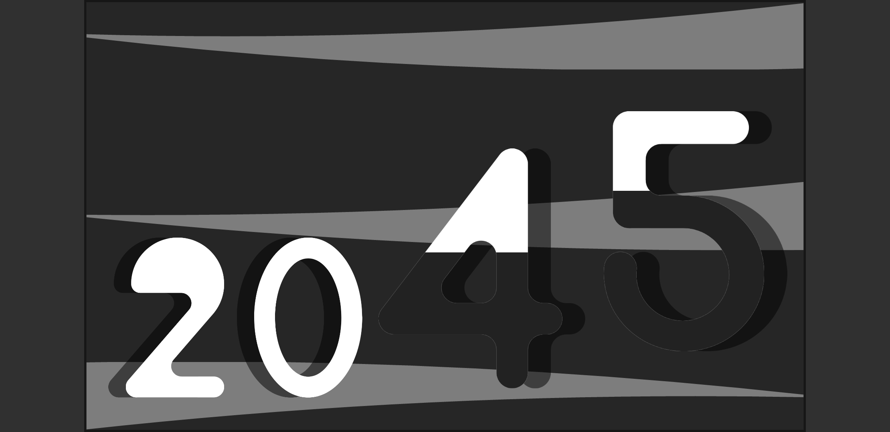
## Sunny
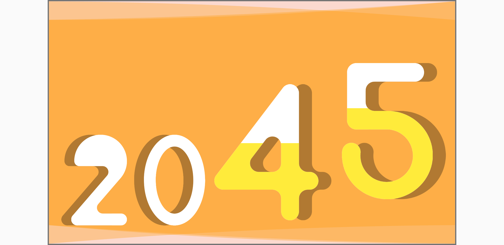 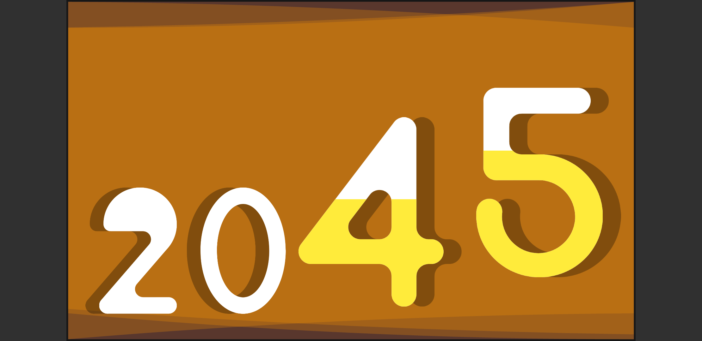
## Thunderstorm
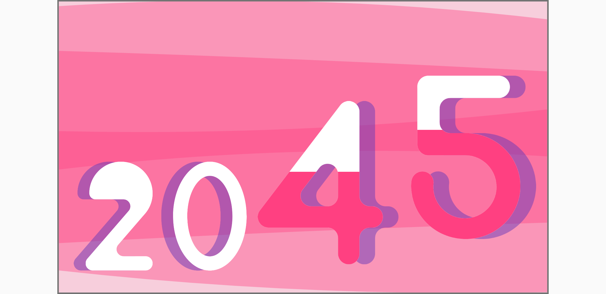 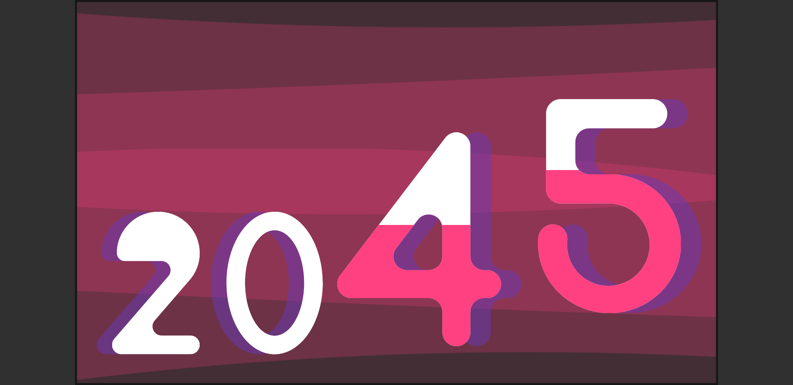
## Windy
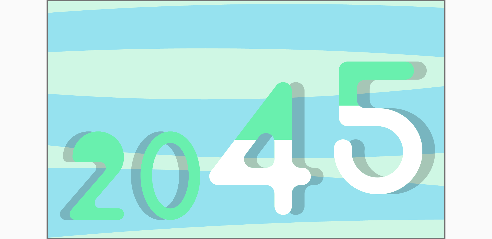 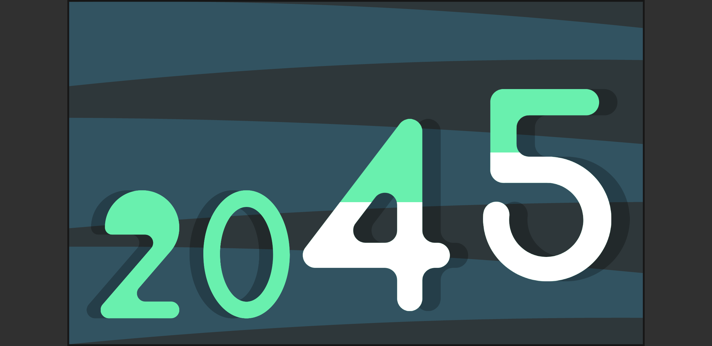
